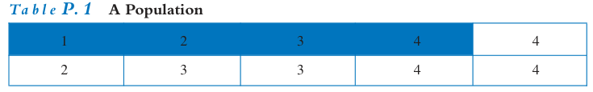
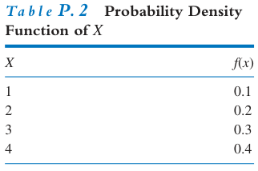
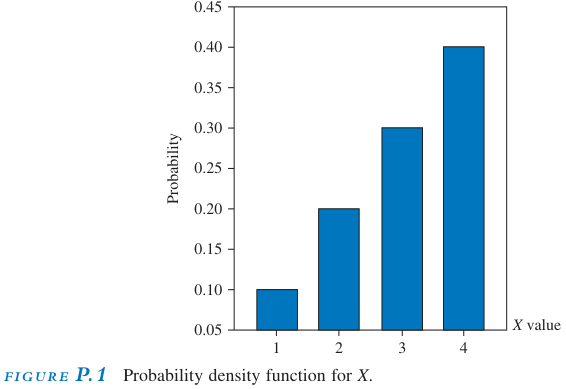

Source: Principles of Econometrics 4th ed by R.Carter Hill

## Random Variable
A random variable is a variable whose value is unknown until it is observed—in other words, a variable that is not perfectly predictable. Each random variable has a set of possible values it can take.

For example, if W represents the number of games our football team wins next year, then W can take the values 0, 1, 2, ..., up to 13, assuming there are at most 13 games. This is a discrete random variable because it can only take a limited or countable number of values.

A special case of a discrete random variable occurs when it can take only two possible values. For instance, in a phone survey, if you are asked whether you are a college graduate, your answer can only be "yes" or "no." Outcomes like this can be represented using an indicator variable, which takes the value 1 if the answer is "yes," and 0 if the answer is "no." Indicator variables are discrete and are commonly used to represent qualitative characteristics, such as gender (male or female) or race (white or nonwhite).

On the other hand, GDP (Gross Domestic Product) can, for practical purposes, take any value in the interval from zero to infinity. It is therefore treated as a continuous random variable. Other common macroeconomic variables, such as interest rates, investment, and consumption, are also modeled as continuous random variables. In finance, stock market indices like the Dow Jones Industrial Index are treated the same way. The defining feature of these variables is that they can take any value within a given interval, which makes them continuous.

## Probability Distributions
Probability is usually defined in terms of experiments.

---
title: "Research Methodology - Quantitative"
output: html_document
---

### Probability Density Function (PDF)

We summarize the probabilities of possible outcomes using a **probability density function** (pdf).  
The pdf for a discrete random variable indicates the probability of each possible value occurring.

Let **X** be a discrete random variable. Then the value of the probability density function **f(x)** is defined as:

$$
f(x) = P(X = x)
$$

Because **f(x)** is a probability, the following conditions must hold:

- \( 0 \leq f(x) \leq 1 \)
- If **X** takes **n** possible values \( x_1, x_2, \ldots, x_n \), then their total probability must sum to 1:

$$
f(x_1) + f(x_2) + \cdots + f(x_n) = 1
$$

### Cumulative Distribution Function (CDF)

An alternative way to represent probabilities is through the **cumulative distribution function** (cdf).

The cdf of the random variable **X**, denoted **F(x)**, gives the probability that **X** is less than or equal to a specific value **x**:

$$
F(x) = P(X \leq x)
$$

